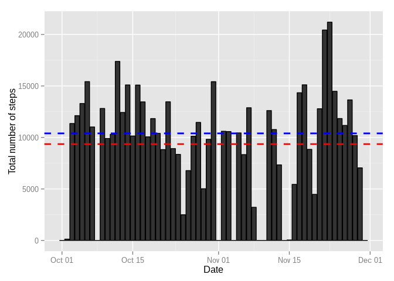
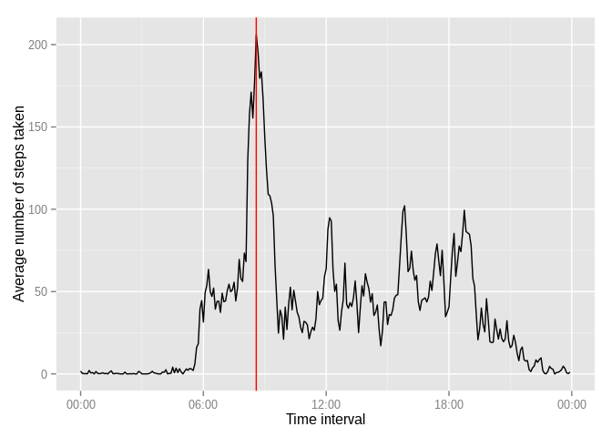
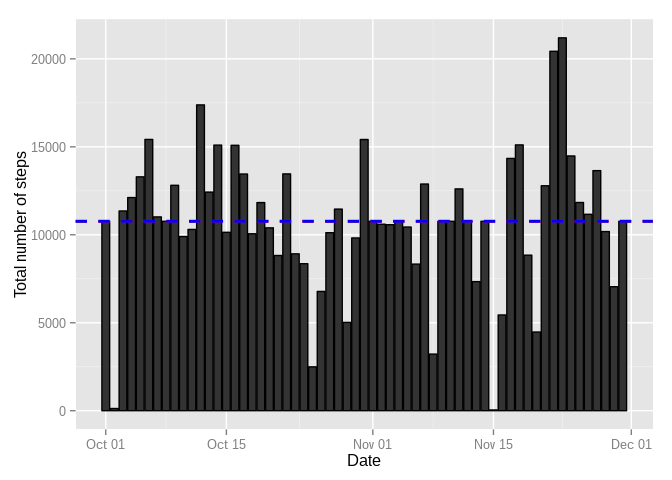
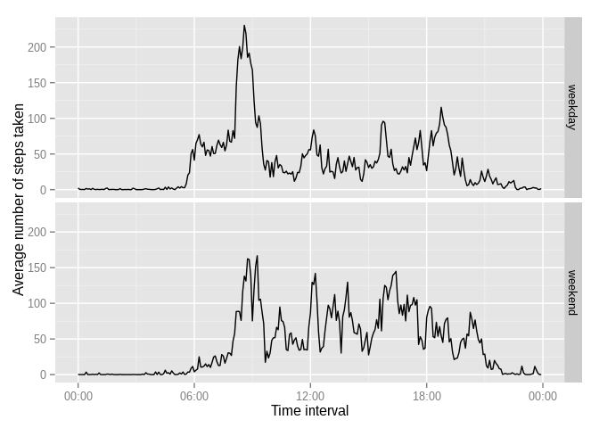

# Reproducible Research: Peer Assessment 1

## Loading libraries necessary to perform the analysis

We will use dplyr for data transformations and ggplot2 for charts.


```r
library(dplyr)
library(ggplot2)
library(scales)
```


## Loading and preprocessing the data

Assuming the data file can be found in the current directory. 


```r
raw_data <- read.csv("activity.csv")
```

Here we also add some columns to use them further:

* date - date column converted to a Date type

* interval_t - interval converted to POSIXct datetime. Since we don't have a time-only type in R we use datetime with current date in its date part. This column is useful to show interval-based time-series axis labels properly

* day_type - "weekday" for all days from Monday to Friday and "weekend" for weekends respectively


```r
data <- raw_data %>%
    mutate(
        date = as.Date(date), 
        interval_t = as.POSIXct(sprintf("%02d:%02d", interval %/% 100, interval %% 100), format="%H:%M"),
        day_type = ifelse(weekdays(as.Date(date)) %in% c("Saturday", "Sunday"), "weekend", "weekday")
    )
```

## What is mean total number of steps taken per day?

To answer this question first we need aggregate data by day and calculate steps total:


```r
by_day <- data %>%
    group_by(date) %>%
    summarise(total = sum(steps, na.rm=TRUE))
```

Visualise it. Red line marks mean value and the blue one for median.


```r
print(ggplot(by_day, aes(x = date, y = total)) 
    + geom_histogram(stat = "identity", color="black")
    + geom_hline(aes(yintercept = mean(by_day$total, na.rm=TRUE)), color="red", linetype="dashed", size=1)
    + geom_hline(aes(yintercept = median(by_day$total, na.rm=TRUE)), color="blue", linetype="dashed", size=1)
    + xlab("Date")
    + ylab("Total number of steps")
)
```

 

Mean total number of steps taken by day is:


```r
mean(by_day$total, na.rm=TRUE)
```

```
## [1] 9354.23
```

and median:


```r
median(by_day$total, na.rm=TRUE)
```

```
## [1] 10395
```

## What is the average daily activity pattern?

Aggregating by 5-minute interval:


```r
by_interval <- data %>%
    group_by(interval, interval_t) %>%
    summarise(mean = mean(steps, na.rm=TRUE))
```

Find interval with maximum average steps per day:


```r
max_steps <- max(by_interval$mean)
max_row <- by_interval %>%
    filter(mean == max_steps)
max_interval <- max_row$interval_t
```

Showing the chart. Red line marks the interval when maximum average steps taken over the period


```r
print(ggplot(by_interval, aes(x = interval_t, y = mean))
    + geom_line(color="black")
    + scale_x_datetime(labels=date_format("%H:%M"))
    + geom_vline(xintercept = as.numeric(max_row$interval_t), color = "red")
    + xlab("Time interval")
    + ylab("Average number of steps taken")
)
```

 

Time interval when the maximum occurred:


```r
strftime(max_interval, format="%H:%M")
```

```
## [1] "08:35"
```

## Imputing missing values

Ok, let check how many NA values we have in our dataset:


```r
sum(is.na(data$steps))
```

```
## [1] 2304
```

We will impute missing values with means of respective 5-minute interval. To achieve this let's join the original dataset
with the table where interval means are already computed:


```r
data_imputed <- left_join(data, by_interval, by = c("interval")) %>%
    mutate(steps = ifelse(is.na(steps), mean, steps)) %>%
    select(steps, date, interval_t=interval_t.x, day_type)
```

Imputing missing values should change mean values calculated before with the original data:


```r
by_day2 <- data_imputed %>%
    group_by(date) %>%
    summarise(total = sum(steps, na.rm=TRUE))

print(ggplot(by_day2, aes(x = date, y = total)) 
    + geom_histogram(stat = "identity", color="black")
    + geom_hline(aes(yintercept = mean(by_day2$total)), color="red", linetype="dashed", size=1)
    + geom_hline(aes(yintercept = median(by_day2$total)), color="blue", linetype="dashed", size=1)
    + xlab("Date")
    + ylab("Total number of steps")
)
```

 

Mean:

```r
mean(by_day2$total)
```

```
## [1] 10766.19
```
Median:

```r
median(by_day2$total)
```

```
## [1] 10766.19
```

Somehow that have changed

## Are there differences in activity patterns between weekdays and weekends?

Here is the chart that answers this question:


```r
by_interval2 <- data_imputed %>%
    group_by(interval_t, day_type) %>%
    summarise(mean = mean(steps))

print(ggplot(by_interval2, aes(x = interval_t, y = mean))
    + geom_line(color="black")
    + scale_x_datetime(labels=date_format("%H:%M"))
    + facet_grid(day_type ~ .)
    + xlab("Time interval")
    + ylab("Average number of steps taken")
)
```

 

We can see that weekday and weekend activities demonstrate two slightly different patterns:

* Weekend activity starts roughly 2 hours later

* Weekday activities have distinct morning and evening peaks
